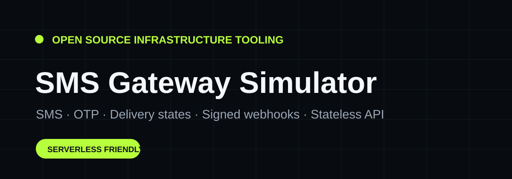

<div align="center">


# SMS Gateway Simulator

### Test SMS, OTP and webhook integrations without a telecom provider.

**Stateless API · Delivery lifecycle · OTP · HMAC webhooks · OpenAPI · Docker · CI**

[](https://nextjs.org/)
[](https://www.typescriptlang.org/)
[](./LICENSE)
</div>

---

## Why this exists

Teams integrating SMS often need provider credentials, live credits and real phone numbers just to test basic application behavior. **SMS Gateway Simulator** provides a safe local/public sandbox for those development flows.

It does **not** send real SMS and contains no operator credentials.

## What it simulates

- SMS acceptance (`queued`)
- provider handoff (`sent`)
- final delivery (`delivered` / `failed`)
- configurable latency and failure rate
- forced delivery/failure scenarios for tests
- OTP generation, expiry and verification
- signed lifecycle/webhook events
- optional Bearer API key protection
- E.164 destination validation

## Stateless architecture

The simulator does not require a database. SMS and OTP state is encrypted into opaque IDs with **AES-256-GCM**. Status endpoints decrypt the ID and derive lifecycle state from elapsed time.

This makes the simulator resilient to serverless cold starts and ideal for Vercel, Docker and local CI.

See [`docs/ARCHITECTURE.md`](./docs/ARCHITECTURE.md).

## Quick start

```bash
git clone https://github.com/popytech/sms-gateway-simulator.git
cd sms-gateway-simulator
npm install
cp .env.example .env.local
npm run dev
```

Set a local secret:

```env
SIMULATOR_SECRET=a-long-random-development-secret
SIMULATOR_EXPOSE_OTP=true
```

Open `http://localhost:3000`.

## Send an SMS

```bash
curl -X POST http://localhost:3000/api/v1/messages \
  -H "Content-Type: application/json" \
  -d '{
    "to": "+224612345678",
    "body": "Your verification code is 482901",
    "sender_id": "DEMO"
  }'
```

Then poll:

```bash
curl http://localhost:3000/api/v1/messages/<message_id>
```

The status moves from `queued` → `sent` → `delivered` or `failed` based on the simulation parameters encoded in that ID.

## Force a failure

```json
{
  "to": "+224612345678",
  "body": "Testing failure handling",
  "simulation": {
    "latency_ms": 500,
    "delivery_delay_ms": 1000,
    "final_status": "failed"
  }
}
```

## OTP

`POST /api/v1/otp/send`

```json
{
  "to": "+224612345678",
  "ttl_seconds": 300,
  "length": 6
}
```

Then verify with `POST /api/v1/otp/verify` using the returned `id` and code.

## Webhook signatures

Lifecycle events returned by `/api/v1/messages/{id}/events` include an HMAC-SHA256 signature. The signing endpoint is also available at `/api/v1/webhooks/sign`.

## API reference

- `GET /api/health`
- `POST /api/v1/messages`
- `GET /api/v1/messages/{id}`
- `GET /api/v1/messages/{id}/events`
- `POST /api/v1/otp/send`
- `POST /api/v1/otp/verify`
- `POST /api/v1/webhooks/sign`
- `GET /api/openapi`

A human-readable docs page is available at `/docs`.

Ready-to-run integration examples are included in [`examples/`](./examples) for Node.js, Python and PHP. A Postman collection is available in [`postman/`](./postman).

## Quality

```bash
npm run lint
npm run typecheck
npm test
npm run build
```

The same pipeline runs with GitHub Actions.

## Docker

```bash
docker compose up --build
```

The Docker build uses Next.js standalone output. Vercel uses the native Next.js output.

## Security

Read [`SECURITY.md`](./SECURITY.md). This is a development simulator, not a production SMS gateway.

## Roadmap

- [ ] SMPP packet fixture mode
- [ ] provider-specific error catalogs
- [ ] rate-limit simulation
- [ ] batch messaging endpoint
- [x] SDK examples (Node/Python/PHP)
- [x] Postman collection
- [ ] inbound SMS simulator

## License

MIT.

---

<div align="center">
Built by <strong>Popy Traoré</strong> · Guinea 🇬🇳 → Africa 🌍
</div>
